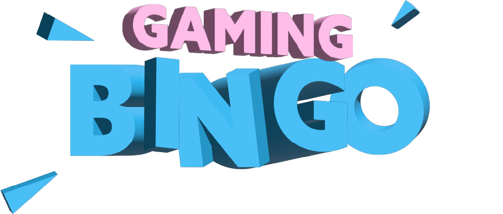

# Bingo Game

This project is a Bingo game built with React.js. It follows the rules of traditional Bingo, where players can win by matching numbers in a row, column, or diagonal. The game includes a bonus field in the center and allows for multiple bingos.

## Features

- Responsive design: The game is designed to work seamlessly across different screen sizes and devices.
- Multiple winning options: Players can win by matching numbers in a row, column, or diagonal.
- Bonus field: There is a special bonus field in the center that can contribute to winning combinations.
- Multiple bingos: The game allows for multiple players to achieve Bingo simultaneously.

## How to Run the Game

Follow these steps to run the Bingo game locally:

1. Clone the repository: `git clone https://github.com/ilkersatir/bingo.git`
2. Navigate to the project directory: `cd bingo`
3. Install the dependencies: `npm install` or `yarn add`
4. Start the development server: `npm start` or `yarn start`
5. Open your browser and visit `http://localhost:3000` to access the game.

## Build and Deploy the Game

1. Clone the repository: `git clone https://github.com/ilkersatir/bingo.git`
2. Navigate to the project directory: `cd bingo`
3. Install the dependencies: `npm install` or `yarn add`
4. Build the project: `npm run build` or `yarn build`
5. Set up a server to host the game (see below for details)

- Option 1: Static file hosting services
  You can use services like GitHub Pages, Netlify, or Vercel for easy deployment.
  Consult the documentation of your chosen service for detailed instructions on how to deploy a static website.
- Option 2: Cloud hosting
  If you prefer more control, you can deploy the built files to a cloud hosting service like AWS S3, Google Cloud Storage, or Azure Blob Storage.
  Follow the respective cloud service's documentation to upload the built files and configure hosting settings.
- Option 3: Traditional server
  If you have access to a traditional web server, you can deploy the built files by copying them to the server's document root directory.
  Use SSH or an FTP client to connect to your server and upload the contents of the build directory.
  Once the project is deployed, the Bingo game should be accessible through the provided URL or the configured server address.

## Technologies Used

- React.js: A JavaScript library for building user interfaces.
- HTML: Markup language for creating the structure of the game.
- SCSS: Stylesheets for the visual presentation of the game.

## Contributing

Contributions to the project are welcome! If you find any bugs or have suggestions for improvement, please open an issue or submit a pull request.

## License

This project is licensed under the [MIT License](LICENSE).
